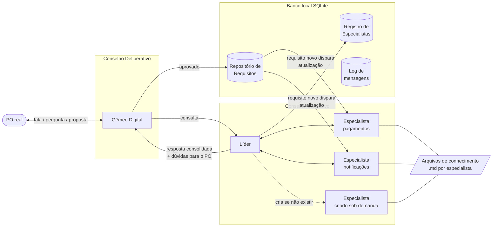

# GigaBrain

Conselho multiagente para **definição de requisitos de software**. O PO conversa com
um Gêmeo Digital, que consulta especialistas por tema de negócio antes de propor
requisitos. Tudo o que é aprovado vai para um repositório local com versões e
rastreabilidade.

O GigaBrain **não acessa código**. O conhecimento vem dos requisitos já aprovados,
dos documentos do projeto e do que o PO diz.

## Arquitetura



### O que acontece numa conversa

1. O PO descreve o que quer.
2. O **Gêmeo** decide: perguntar ao PO, consultar o Conselho Consultivo ou propor.
3. Ao consultar, o **Líder** divide a pergunta por tema, usa os especialistas que já
   existem e cria os que faltam (no modo `reuniao` não cria; registra uma pendência).
4. Cada **especialista** responde com base no seu arquivo de conhecimento e nos
   requisitos do seu tema, e pode devolver dúvidas para o PO.
5. O Líder consolida, aponta conflitos e devolve ao Gêmeo, que leva as dúvidas ao PO
   ou faz a proposta.
6. O PO aprova (só uma aprovação explícita conta: "aprovado, mas..." não salva).
7. O requisito é salvo com fontes e ligações; quem dependia de um requisito que mudou
   fica `em_revisao`; os especialistas dos temas envolvidos atualizam o conhecimento.

### Rastreabilidade entre requisitos

Cada requisito tem versões (nenhuma é apagada) e ligações, lidas como
"origem *tipo* destino":

| Ligação | Significado | Efeito no destino |
|---|---|---|
| `refina` | detalha o destino | continua valendo |
| `divide` | é uma das partes do destino | vira `dividido` |
| `junta` | resultou da junção do destino com outros | vira `unido` |
| `substitui` | toma o lugar do destino | vira `substituido` |
| `depende_de` | precisa do destino | se o destino mudar, a origem vai para `em_revisao` |
| `conflita_com` | contradiz o destino | o PO decide |

`python main.py trilha R3` responde "como chegamos no R3?".

### Como um especialista é atualizado

O conhecimento de cada especialista é um arquivo Markdown (`dados/conhecimento/<tema>.md`)
com seções fixas: regras de negócio, glossário, decisões (e o porquê), requisitos
aprovados e pontos em aberto. Cada mudança vira uma versão no banco, com motivo e hash.
Gatilhos:

- **requisito aprovado** no tema (ou nova versão, substituição, divisão)
- **documento do projeto** entregue a ele: `python main.py alimentar pagamentos ata.md`
- **edição manual** do arquivo: detectada pelo hash na próxima consulta

Acima de ~12 mil caracteres o especialista é instruído a resumir e reorganizar o arquivo.

### Mensagens em JSON

Toda troca entre agentes é uma `Mensagem` com `de`, `para`, `tipo` e `conteudo`. Cada
mensagem vai para a tabela `evento` e para `dados/logs/<conversa>.jsonl`. Os agentes
também falam com o LLM só em JSON (entrada e saída).

## Como rodar

```bash
pip install -r requirements.txt

# Sem chave de API: conversas prontas com o provedor simulado
python main.py demo
python main.py --dados dados-demo painel

# Conversa de verdade com a DeepSeek
$env:DEEPSEEK_API_KEY="sua-chave"        # PowerShell
python main.py conversar
python main.py conversar --modo reuniao  # não cria especialistas, só usa os existentes
python main.py conversar --simulado      # testar sem API

# Consultas rápidas
python main.py requisitos
python main.py trilha R3
python main.py especialistas

# Testes
python -m unittest discover tests
```

O painel (`python main.py painel`) tem quatro abas:

- **Arquitetura**: reproduz uma conversa passo a passo, destacando quem fala com quem
- **Conversas**: linha do tempo das mensagens JSON de cada conversa
- **Requisitos**: grafo de ligações, versões, fontes e a trilha de cada requisito
- **Especialistas**: o arquivo de conhecimento, cada versão e o que mudou entre elas

## Roteiro para ler o código

| Ordem | Arquivo | O que tem |
|---|---|---|
| 1 | `gigabrain/mensagens.py` | o envelope JSON e os tipos de mensagem |
| 2 | `gigabrain/banco.py` | as tabelas, versões, ligações e trilha |
| 3 | `gigabrain/conhecimento.py` | o arquivo de conhecimento dos especialistas |
| 4 | `gigabrain/aprovacao.py` | quando uma fala do PO conta como aprovação |
| 5 | `gigabrain/provedores.py` | DeepSeek e o simulador offline |
| 6 | `gigabrain/agentes/base.py` | o que todo agente sabe fazer (enviar, chamar o LLM) |
| 7 | `gigabrain/agentes/gemeo.py` | o Gêmeo Digital e seu prompt |
| 8 | `gigabrain/agentes/lider.py` | decomposição, criação e consolidação |
| 9 | `gigabrain/agentes/especialista.py` | responder e atualizar o conhecimento |
| 10 | `gigabrain/conselho.py` | o fluxo inteiro de uma conversa |
| 11 | `gigabrain/log.py` | para onde vai cada mensagem |
| 12 | `main.py` e `gigabrain/demo.py` | linha de comando e demonstração |
| 13 | `gigabrain/painel/` | servidor e página do painel |

`arquitetura.html` e `editor.html` são a nota e o editor do diagrama original.
